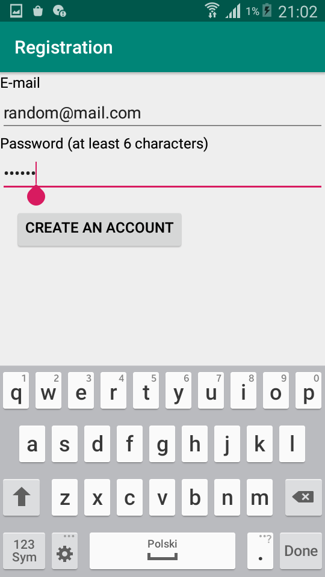
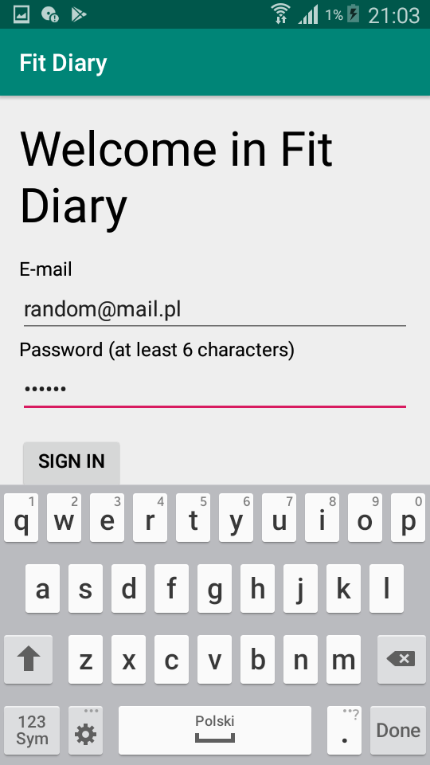
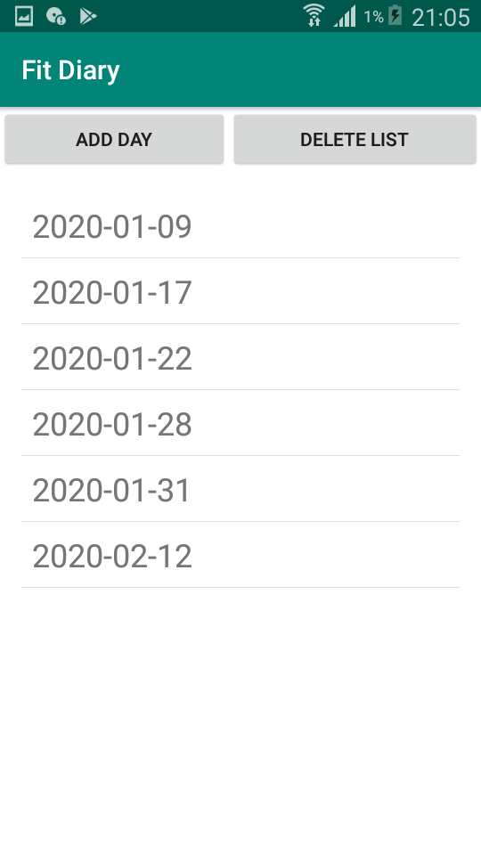
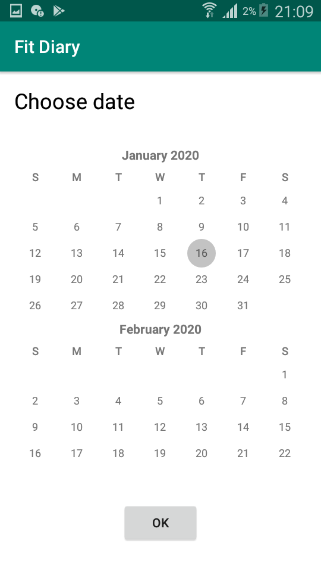
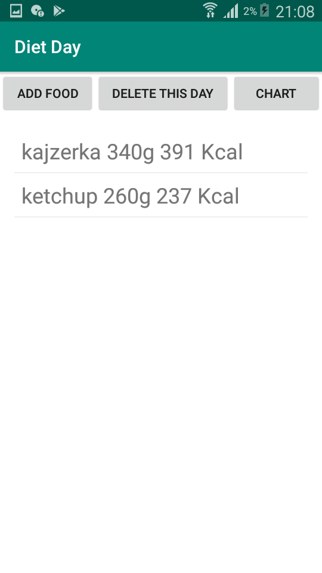
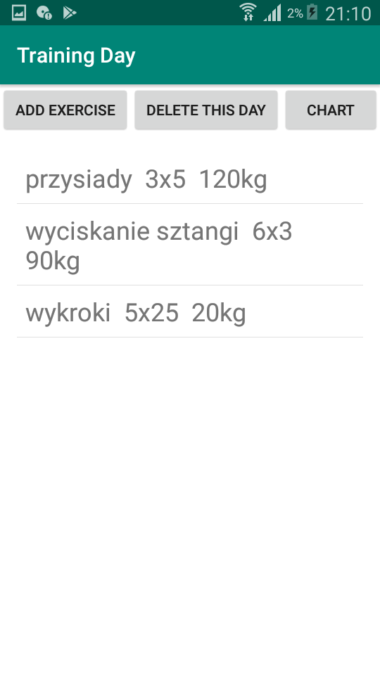
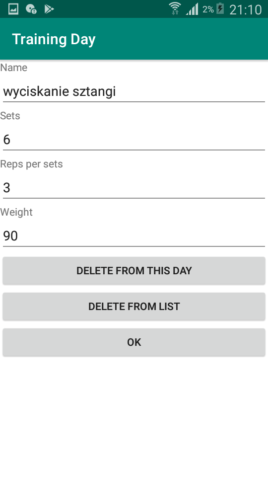
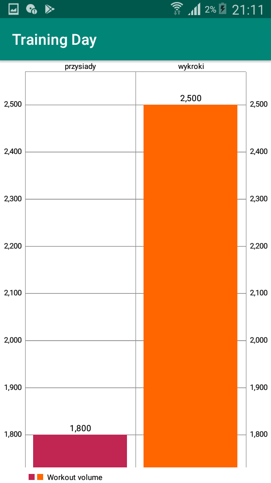

# FitDiary

Projekt z przemdiotu Porjektowanie zdarzeniowe

Projekt służy jako aplikacja ułatwiająca osobom aktywnym monitorować swojej aktywności fizyczne oraz
poczynań dietetycznych. Jest to aplikacja na urządzenia mobilne z systemem Android. Do administrowania danymi wykorzystałem narzędzie Google Firebase, a  w nim korzystałem z NoSql'oewj bazy danych. Ponadto wykorzystałem narzedzie do autentykacji użytkowników również w Firebase.
Aplikacja realizując takie funkcjonalności jak:

* Rejestracja użytkownikówpoprzez e-mail i hasło

* Logowanie danymi stworzonymi wcześniej podczas rejestracji użytkownika
 
 
* Ma dwie główne tematy zastosowań, czyli dietę i trening
    
    
* Pozwala na dodawanie do listy dni, dla których chcemy zapisać trening czy też posiłki z danego dnia. Jest możliwość szybkiego usuniecia całej listy lub  po wybraniu danego dnia można usunąć tylko ten wybrany
    
    
* Dzień wybiera się poprzez zaznaczenie odpowiedniego pola w kalendarzu, tak samo wygląda to w przypadku treningów
     
     
* Można tworzyć własne produkty, nadając im odpowiednie makrosładniki oraz gramaturę. Na podstawie tych danych aplikacja oblicza wartość energetyczną w kilokaloriach dostarczoną z danego produktu
     ![rejestracja](images/Screenshot_2020-01-16-22-33-53.png
     
* Produkty z danego dnia wyświetlają się w formie listy wraz z gramaturą i kaloryką poniżej mamy 
przykład studenckiego dania buła z ketchupem
     
     
* Jest możliwość wyświetlania statystyk z jedzenia, czyli sumaryczną gramature dla każdego
makroskładnika oraz kalorykę dnia w postaci wykresu kołowego, 
     
 
 * Analogicznie do posiłków z dnia wyświetlają się ćwiczenia z danego dnia. W liście widać ilość powtórzeń, serii oraz ciężar w kg jakim bvyła wykonywana dana seria
     
 
  * Można tworzyć nowe ćwiczenia, lub korzystać z wcześniej utowrzonych, jest też możliwość usunięcia ćwiczenia, zarówno z listy ćwiczeń z danego dnia jak i z listy utowrzonyhc ćwiczeń przez danego użytkownika
     
  
  * W przypadku treningów statystyki prezentowane są jako objętość treningowa dla każdego ćwiczenia, przedstawiona na wykresie kolumnowym
     

